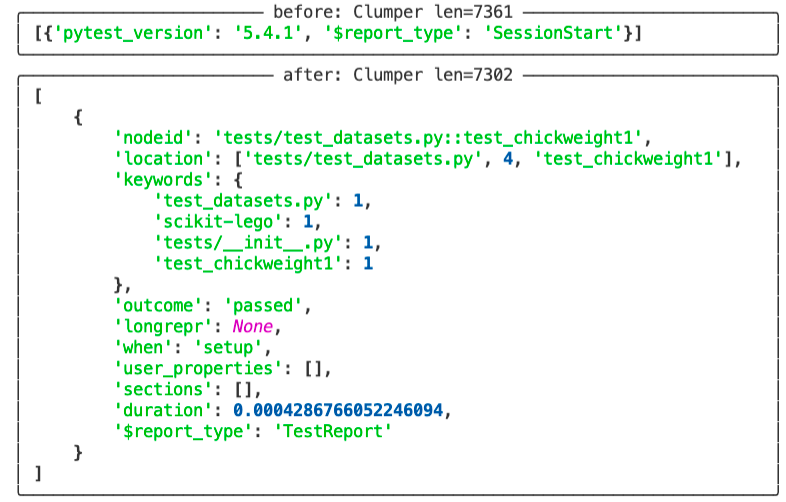

Pytest has a very convenient plugin that allows you to get some insights from your pytest runs. It's called [pytest-reportlog](https://github.com/pytest-dev/pytest-reportlog). It's a great plugin but the jsonlines that it produces do not adhere to a schema. That means that there's a great use-case for clumper.

## Getting the Logs

First we need to generate the logs. In this demo I'll use the [scikit-lego](https://github.com/koaning/scikit-lego) project as an example. From the root of the project you can install the plugin and generate the logfile via:

```bash
> python -m pip install pytest-reportlog
> pytest --report-log sklego-log.jsonl tests
```

Once the `sklego-log.jsonl` file has been created we can explore it with clumper.

```python
from clumper import Clumper
clump = Clumper.read_jsonl("tests/data/docs/sklego-log.jsonl")
```

## Cleanup

The first thing we'll need to do is the clean the collection. Not every item in the log
belongs to a test-run so we will need to apply some filtering. If a dictionary does not
have a `"duration"` as a key then we'll remove it from the collection. The query below
does this but also demonstrates the effect.

```python
from clumper import Clumper
clump = Clumper.read_jsonl("tests/data/docs/sklego-log.jsonl")

clump.keep(lambda d: 'duration' in d.keys())
```

To get a picture of what items we have before/after the operation it helps to
also add some `show()`-verbs in the chain as well.

```python
from clumper import Clumper
clump = Clumper.read_jsonl("tests/data/docs/sklego-log.jsonl")

(clump
  .show(name="before", n=1)
  .keep(lambda d: 'duration' in d.keys())
  .show(name="after", n=1))
```

If you've got [rich](https://github.com/willmcgugan/rich) installed in your virtualenv then this is the pretty output.



## Information

Given these `"after"`-dictionaries we can create a utility function that will help us aggregate data in interesting ways.

```python
from clumper import Clumper
clump = Clumper.read_jsonl("tests/data/docs/sklego-log.jsonl")

(clump
 .keep(lambda d: 'duration' in d.keys())
 .mutate(file=lambda d: d['location'][0],
         test=lambda d: d['location'][-1])
 .group_by("file")
 .agg(n=("test", "count"), duration=("duration", "sum"))
 .ungroup()
 .sort(lambda d: -d['duration'])
 .head(5)
 .collect())
```

These are the results.

```txt
[{'file': 'tests/test_estimators/test_umap_reconstruction.py',
  'n': 54,
  'duration': 36.16924691200256},
 {'file': 'tests/test_model_selection/test_klusterfold.py',
  'n': 729,
  'duration': 14.112273454666138},
 {'file': 'tests/test_estimators/test_basics.py',
  'n': 810,
  'duration': 12.211206436157227},
 {'file': 'tests/test_estimators/test_gmm_naive_bayes.py',
  'n': 75,
  'duration': 7.968780517578125},
 {'file': 'tests/test_meta/test_grouped_transformer.py',
  'n': 546,
  'duration': 3.5306169986724854}]
```

This is useful information because it tells us which files cause the
most time consuming parts of the test run. You can explore it
further if you're also interested in zooming in on parametrized tests.

## Fancy Layouts

We could take our script a step further if we wanted it to show
the hierarchy. Let's nest the names of the tests in here as well.

```python
from clumper import Clumper
clump = Clumper.read_jsonl("tests/data/docs/sklego-log.jsonl")

(clump
 .keep(lambda d: 'duration' in d.keys())
 .mutate(file=lambda d: d['location'][0],
         test=lambda d: d['location'][-1])
 .group_by("file")
 .agg(n_test=("test", "n_unique"),
      duration=("duration", "sum"),
      tests=("test", "unique"))
 .ungroup()
 .sort(lambda d: d['n_test'])
 .head(5)
 .collect())
```

These are the new results.

```txt
[{'duration': 0.0018439292907714844,
  'file': 'tests/test_notinstalled.py',
  'n_test': 2,
  'tests': ['test_uninstsalled_package_raises',
            'test_installed_package_works']},
 {'duration': 0.012597322463989258,
  'file': 'tests/test_metrics/test_correlation_score.py',
  'n_test': 2,
  'tests': ['test_corr_pandas',
            'test_corr_numpy']},
 {'duration': 1.3311948776245117,
  'file': 'tests/test_estimators/test_deadzone.py',
  'n_test': 3,
  'tests': ['test_values_uniform[linear]',
            'test_deadzone[check_shape_remains_same_regressor]',
            'test_values_uniform[quadratic]']},
 {'duration': 0.0020287036895751953,
  'file': 'tests/test_common/test_basics.py',
  'n_test': 3,
  'tests': ['test_as_list_strings',
            'test_as_list_other',
            'test_as_list_ints']},
 {'duration': 0.029719829559326172,
  'file': 'tests/test_metrics/test_equal_opportunity.py',
  'n_test': 4,
  'tests': ['test_p_percent_numpy',
            'test_p_percent_pandas_multiclass',
            'test_equal_opportunity_pandas',
            'test_warning_is_logged']}]
```
