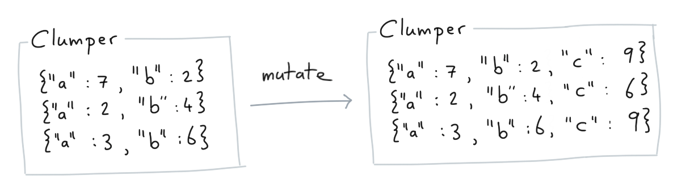

# Getting Started

This library offers tools to deal with nested json data structure. To demonstrate how it might work we'll download a dataset locally. It's a list of dictionaries that contains information about pokemon.

```python
import json
import urllib.request

url = 'http://calmcode.io/datasets/pokemon.json'
with urllib.request.urlopen(url) as f:
    pokemon = json.loads(f.read())
```

Here's the first two examples from this list;

```
[{'name': 'Bulbasaur',
  'type': ['Grass', 'Poison'],
  'total': 318,
  'hp': 45,
  'attack': 49},
 {'name': 'Ivysaur',
  'type': ['Grass', 'Poison'],
  'total': 405,
  'hp': 60,
  'attack': 62}]
```

There's about 800 dictionaries in our list. This is
big enough to not want to go through manually but also
small enough that we don't need to worry too much
about performance.

### Example

Let's run a basic example.

```python
from clumper import Clumper

(Clumper(pokemon)
  .keep(lambda d: len(d['type']) == 1)
  .mutate(type=lambda d: d['type'][0],
          ratio=lambda d: d['attack']/d['hp'])
  .select('name', 'type', 'ratio')
  .sort(lambda d: d['ratio'], reverse=True)
  .head(5)
  .collect())
```

This is the result of this query.

```
[{'name': 'Diglett', 'type': 'Ground', 'ratio': 5.5},
 {'name': 'DeoxysAttack Forme', 'type': 'Psychic', 'ratio': 3.6},
 {'name': 'Krabby', 'type': 'Water', 'ratio': 3.5},
 {'name': 'DeoxysNormal Forme', 'type': 'Psychic', 'ratio': 3.0},
 {'name': 'BanetteMega Banette', 'type': 'Ghost', 'ratio': 2.578125}]
```

Here's what the code did.

0. It imports `Clumper`.
1. It turns the list of pokemon dictionaries into a `Clumper` collection.
2. It removes all the pokemon that have more than 1 type.
3. The dictionaries that are left will have their `type` now as a string instead of a list of strings.
4. These dictionaries will also get a property called `ratio` which is the ratio between `hp` and `attack`.
5. All the keys besides `name`, `type` and `ratio` are removed.
6. The collection is sorted by `ratio`, from high to low.
7. We grab the top 5 after sorting.
8. The results are returned as a list of dictionaries.

## Design

The idea behind the library is that the API is like the English language.
We could say that the dataset is like a **noun** and that each method is like a **verb**.

Each verb will tell the API *what* needs to happen to the data and the
input to the verb will tell you *how* this will happen. For example,
the `.keep()` method will filter out data and how it will filter data is
explained by the lambda function that we pass in.

The idea is that most analyses that you'd be interested in doing can be
constructed using just these verbs. You can see a detailed view of how to use all the verbs in the [api description](/api/clumper/).

<small>We did not come up with this way of thinking about data analysis. In fact, this library is *heavily* inspired by the [dplyr library in R](https://dplyr.tidyverse.org/). </small>

## What are Verbs?

In this library verbs are special kinds of methods. They really are
just methods in essense but they imply a general pattern. In `Clumper`,
a verb is a method that;

1. Always returns a `Clumper` back, so it's chain-able.
2. Has a name that tells you *what* is happening to the data while
the parameters tell you *how* it is changing the data.

This combination of properties allows you to write code in the same
way you'd explain the steps to a human. Take this code for example.

```python
from clumper import Clumper

list_of_dicts = [
    {'a': 7, 'b': 2},
    {'a': 2, 'b': 4},
    {'a': 3, 'b': 6}
]

(Clumper(list_of_dicts)
  .mutate(c = lambda d: d['a'] + d['b'])
  .sort(lambda d: d['c']))
```

Schematically, this is what the code does.

### Step 1

First we use the **mutate** verb. This allows us to add values to pairs in
our collection.



The output of this step is another `Clumper` collection.

### Step 2

Next we pick up the mutated collection and we apply a sort to it.


Again, the output of this another `Clumper`. This means that we can
keep adding steps as we further our analysis.

## Method Chaining

This style of programming is really powerful and it keeps you productive
once you've gotten a hang of the lambda functions. The lambda functions
that you pass in can be general python. This also means that you're free
to use nested dictionaries, sets or whatever you like doing in python.
