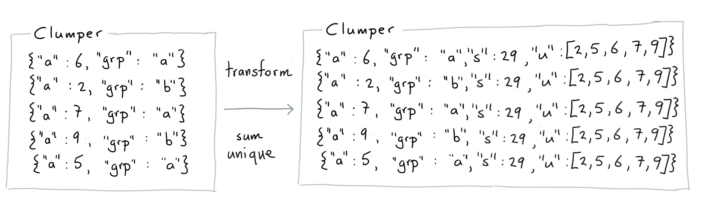
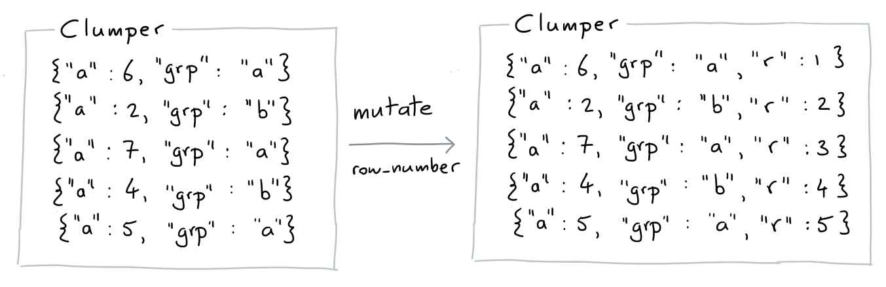
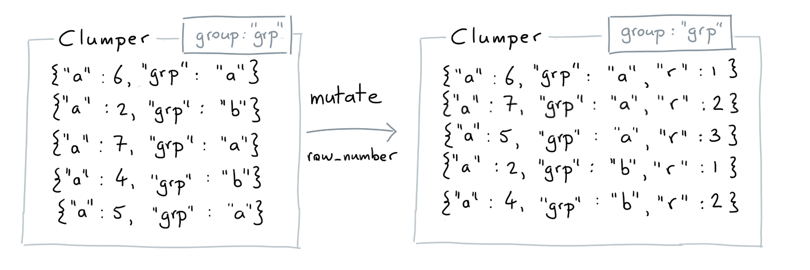
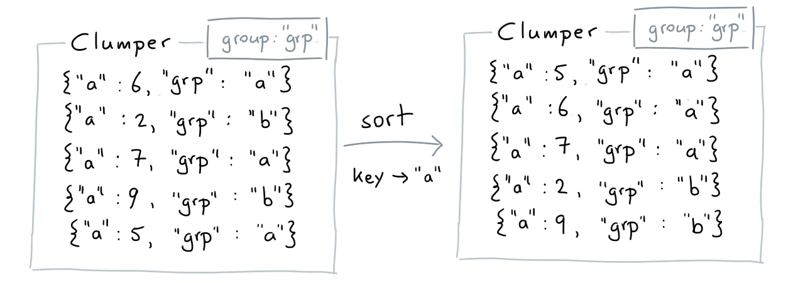

If a group is present on a `Clumper` then the behavior
of some of the verbs will change. This guide will explain
what changes you can expect and why they are useful.

## What is a Group?

You can add a group to a `Clumper` by calling `.group_by()`.

```python
from clumper import Clumper

list_dicts = [
    {'a': 6, 'grp': 'a'},
    {'a': 2, 'grp': 'b'},
    {'a': 7, 'grp': 'a'},
    {'a': 4, 'grp': 'b'},
    {'a': 5, 'grp': 'a'}
]

(Clumper(list_dicts)
  .group_by('grp'))
```

The current group is now looking at all the items that have `grp` as a key.


This means that the collection is now aware that you're interested
in calculating things per group. In this case you'd get two groups. One for
`{'grp': 'a'}` and one for `{'grp': 'b'}`.

There are some verbs that will behave differently because of this.

### Agg

#### Without Groups

When you don't have a group active then we'll make a single
summary for the entire collection of items.


```python
from clumper import Clumper

list_dicts = [
    {'a': 6, 'grp': 'a'},
    {'a': 2, 'grp': 'b'},
    {'a': 7, 'grp': 'a'},
    {'a': 4, 'grp': 'b'},
    {'a': 5, 'grp': 'a'}
]

(Clumper(list_dicts)
  .agg(s=('a', 'sum'),
       m=('a', 'mean'))
  .collect())
```

#### With Groups

When there is a group active then we'll make a summary
per group. We'll also ensure that the keys of the relevant
groups are made available in the new collection.

Note that the `group` is still active!


```python
from clumper import Clumper

list_dicts = [
    {'a': 6, 'grp': 'a'},
    {'a': 2, 'grp': 'b'},
    {'a': 7, 'grp': 'a'},
    {'a': 4, 'grp': 'b'},
    {'a': 5, 'grp': 'a'}
]

(Clumper(list_dicts)
  .group_by('grp')
  .agg(s=('a', 'sum'),
       m=('a', 'mean'))
  .collect())
```

#### Aggergators

You can use your own functions if you want to do aggregation but we offer a
few standard ones. Here's the standard mapping.

```python
{
  "mean": mean,
  "count": lambda d: len(d),
  "unique": lambda d: list(set(d)),
  "n_unique": lambda d: len(set(d)),
  "sum": sum,
  "min": min,
  "max": max,
  "median": median,
  "var": variance,
  "std": stdev,
  "values": lambda d: d,
  "first": lambda d: d[0],
  "last": lambda d: d[-1],
}
```


### Transform

The `.transform()` verb is similar to the `.agg()` verb. The main difference is
that it does not reduce any rows/keys during aggregation. Instead they are merged
back in with the original collection. The examples below should help explain what
the usecase is.

#### Without Groups

With no groups active we just attach the same summary to every item.



```python
from clumper import Clumper

data = [
    {"a": 6, "grp": "a"},
    {"a": 2, "grp": "b"},
    {"a": 7, "grp": "a"},
    {"a": 9, "grp": "b"},
    {"a": 5, "grp": "a"}
]

tfm_data = (Clumper(data)
             .group_by("grp")
             .transform(s=("a", "sum"),
                        u=("a", "unique"))
             .collect())
```

#### With Groups

With groups active we calculate a summary per group and only attach
the relevant summary to each item.


```python
from clumper import Clumper

data = [
    {"a": 6, "grp": "a"},
    {"a": 2, "grp": "b"},
    {"a": 7, "grp": "a"},
    {"a": 9, "grp": "b"},
    {"a": 5, "grp": "a"}
]

tfm_data = (Clumper(data)
             .group_by("grp")
             .transform(s=("a", "sum"),
                        u=("a", "unique"))
             .collect())
```
### Mutate

This library offers stateful functions like `row_number`. If you use
these functions while there is a group active you'll notice different
behavior.

#### Without Groups

When there is no group we just start counting at one
and we continue counting until we're at the end of the
collection.



```python
from clumper import Clumper
from clumper.sequence import row_number

list_dicts = [
    {'a': 6, 'grp': 'a'},
    {'a': 2, 'grp': 'b'},
    {'a': 7, 'grp': 'a'},
    {'a': 4, 'grp': 'b'},
    {'a': 5, 'grp': 'a'}
]

(Clumper(list_dicts)
  .mutate(r=row_number())
  .collect())
```

#### With Groups

Because there are groups you'll notice that the order
is different but also that the `row_number` resets when
seeing the new group.



```python
from clumper import Clumper
from clumper.sequence import row_number

list_dicts = [
    {'a': 6, 'grp': 'a'},
    {'a': 2, 'grp': 'b'},
    {'a': 7, 'grp': 'a'},
    {'a': 4, 'grp': 'b'},
    {'a': 5, 'grp': 'a'}
]

(Clumper(list_dicts)
  .group_by('grp')
  .mutate(r=row_number())
  .collect())
```

### Sort

#### Without Groups

With no groups active, we just sort the entire collection
based on the `key` that is provided.


```python
from clumper import Clumper

list_dicts = [
    {'a': 6, 'grp': 'a'},
    {'a': 2, 'grp': 'b'},
    {'a': 7, 'grp': 'a'},
    {'a': 9, 'grp': 'b'},
    {'a': 5, 'grp': 'a'}
]

(Clumper(list_dicts)
  .sort(key=lambda d: d['a'])
  .collect())
```

#### With Groups

With groups active, still perform the sorting but only
within each group.



```python
from clumper import Clumper

list_dicts = [
    {'a': 6, 'grp': 'a'},
    {'a': 2, 'grp': 'b'},
    {'a': 7, 'grp': 'a'},
    {'a': 9, 'grp': 'b'},
    {'a': 5, 'grp': 'a'}
]

(Clumper(list_dicts)
  .group_by('grp')
  .sort(key=lambda d: d['a'])
  .collect())
```

## Ungroup

If you're done with a group and you'd like to move on you can drop all
groups by calling `.ungroup()`.
