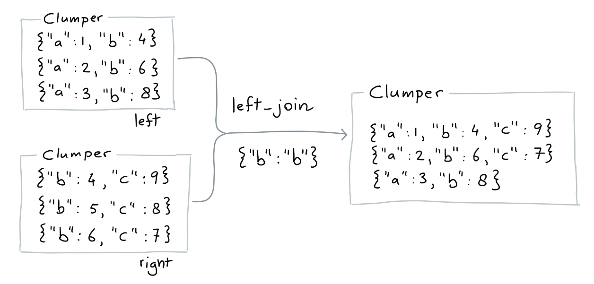
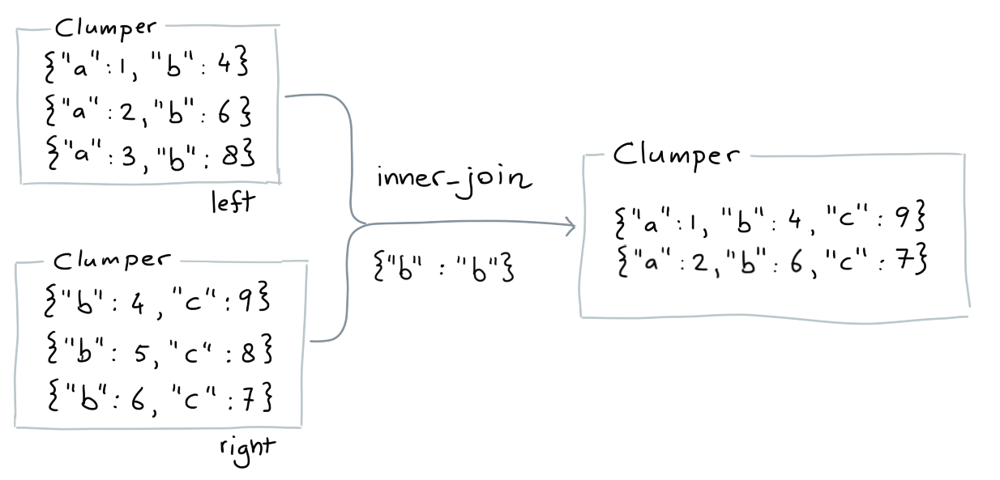

Sometimes you'd like to merge two collections into one.
There's a few ways of doing that in this library.

## Concat

If you just want to stack collections on top
of eachother, you can use `concat` for that. It's
short for "concatenate".


```python
from clumper import Clumper

c1 = Clumper([{"a": 1}])
c2 = Clumper([{"a": 2}])
c3 = Clumper([{"a": 3}])

assert len(c1.concat(c2)) == 2
assert len(c1.concat(c2, c3)) == 3
assert len(c1.concat(c2).concat(c3)) == 3
```

## Joins

If you want to merge two collections together based on
the values then you'd be interested in a `join`. When doing a join there are two sets: a leftset and a right set.
Depending on the type of join that you are performing you will
get different behavior.

### Left Join

A left join keeps all the values from the left table even
when there's nothing from the right table that it can join on.



```python
from clumper import Clumper

left = Clumper([
    {"a": 1, "b": 4},
    {"a": 2, "b": 6},
    {"a": 3, "b": 8},
])

right = Clumper([
    {"c": 9, "b": 4},
    {"c": 8, "b": 5},
    {"c": 7, "b": 6},
])

result = left.inner_join(right, mapping={"b": "b"})
expected = [
    {"a": 1, "b": 4, "c": 9},
    {"a": 2, "b": 6, "c": 7},
    {"a": 3, "b": 8},
]

assert result.equals(expected)
```

Note that items on the left hand side may appear multiple times.

```python
from clumper import Clumper

left = Clumper([
    {"a": 1, "b": 4},
    {"a": 2, "b": 6},
    {"a": 3, "b": 8},
])

right = Clumper([
    {"c": 9, "b": 4},
    {"c": 8, "b": 5},
    {"c": 7, "b": 6},
    {"c": 9, "b": 6},
])

result = left.left_join(right, mapping={"b": "b"})
expected = [
    {'a': 1, 'b': 4, 'c': 9},
    {'a': 2, 'b': 6, 'c': 7},
    {'a': 2, 'b': 6, 'c': 9},
    {'a': 3, 'b': 8}
]

assert result.equals(expected)
```

### Right Join

This is not implemented. You can swap the left/right tables
and still use the left-join for this.

### Inner Join

An inner join only keeps items that can be paired in both
tables.



```python
from clumper import Clumper

left = Clumper([
    {"a": 1, "b":4},
    {"a": 2, "b":6},
    {"a": 3, "b":8},
])

right = Clumper([
    {"c": 9, "b":4},
    {"c": 8, "b":5},
    {"c": 7, "b":6},
])

result = left.inner_join(right, mapping={"b": "b"})
expected = [
    {"a": 1, "b": 4, "c": 9},
    {"a": 2, "b": 6, "c": 7},
]

assert result.equals(expected)
```
