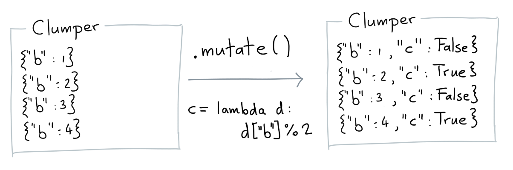
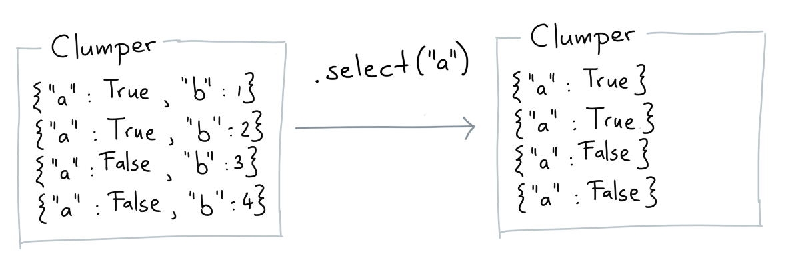

Here's a list of the common verbs that you'll most likely use the most.

## Keep

The **keep** verb allows you to grab a subset from the original collection.


### Base Example

Here's a basic example of what `keep` and do.

```python
from clumper import Clumper

list_dicts = [{'a': 1}, {'a': 2}, {'a': 3}, {'a': 4}]

clump = Clumper(list_dicts).keep(lambda d: d['a'] >= 3)
expected = [{'a': 3}, {'a': 4}]
assert clump.equals(expected)
```

### Dropping Missing Values

Libraries like pandas offer verbs like `.dropna()`.
This library does not because we handle missing values
different. If you've got a collection with a missing value
then you can simply remove it via `.keep()` though.

```python
from clumper import Clumper

data = [
    {"a": 1, "b": 4},
    {"a": 2, "b": 3},
    {"a": 3, "b": 2},
    {"a": 4},
]

clump = Clumper(data).keep(lambda d: 'b' in d.keys())

expected = [
    {"a": 1, "b": 4},
    {"a": 2, "b": 3},
    {"a": 3, "b": 2},
]

assert clump.equals(expected)
```


## Mutate

The **mutate** verb allows you to add/overwrite data to each item in the collection.



### Base Example

```python
from clumper import Clumper

list_dicts = [
    {'a': 1, 'b': 2},
    {'a': 2, 'b': 3, 'c':4},
    {'a': 1, 'b': 6}]

result = (Clumper(list_dicts)
          .mutate(c=lambda d: d['a'] + d['b'],
                  s=lambda d: d['a'] + d['b'] + d['c']))

expected = [
    {'a': 1, 'b': 2, 'c': 3, 's': 6},
    {'a': 2, 'b': 3, 'c': 5, 's': 10},
    {'a': 1, 'b': 6, 'c': 7, 's': 14}
]

assert result.equals(expected)
```

## Sort

The **sort** verb allows you to sort the collection based on values of items.


### Base Example

```python
from clumper import Clumper

list_dicts = [
    {'a': 1, 'b': 2},
    {'a': 3, 'b': 3},
    {'a': 2, 'b': 1}]

(Clumper(list_dicts)
  .sort(lambda d: d['a'])
  .collect())

(Clumper(list_dicts)
  .sort(lambda d: d['b'], reverse=True)
  .collect())
```

## Select

The **select** verb allows you to select a subset of keys for each item.



### Base Example

```python
from clumper import Clumper

list_dicts = [
    {'a': 1, 'b': 2},
    {'a': 2, 'b': 3, 'c':4},
    {'a': 1, 'b': 6}]

clump = Clumper(list_dicts).select('a', 'b')
assert all(["c" not in d.keys() for d in clump])
```

## Drop

The **select** verb allows you to remove a subset of keys for each item.


### Base Example

```python
from clumper import Clumper

list_dicts = [
    {'a': 1, 'b': 2},
    {'a': 2, 'b': 3, 'c':4},
    {'a': 1, 'b': 6}]

clump = Clumper(list_dicts).drop('c')
assert all(["c" not in d.keys() for d in clump])
```

## Group By

The **group_by** verb allows you to set a group on a collection based on
the values of the keys that you pass. The groups represent subsets and
certain verbs will change their behavior if there are groups present.

The main use-case for this verb is in combination with **.agg()**.


### Base Example

```python
from clumper import Clumper

clump = Clumper([{"a": 1}]).group_by("a")
assert clump.groups == ("a", )
```

## Ungroup

The **ungroup** verb will remove any groups currently present.


### Base Example

```python
from clumper import Clumper

clump = Clumper([{"a": 1}]).group_by("a")
assert clump.groups == ("a", )
assert clump.ungroup().groups == tuple()
```

## Agg

The **agg** verb is short for aggregate. They allow you to summarise the data,
keeping in mind any groups that are on it.


When defining a summary to apply you'll need to pass three things:

1. the name of the new key
2. the key you'd like to summarise (first item in the tuple)
3. the summary you'd like to calculate on that key (second item in the tuple)

The following aggregation functions are available: `mean`, `count`, `unique`,
`n_unique`, `sum`, `min` and `max`. For more information on how they work you
can read more info [here]().

### Base Example

```python
from clumper import Clumper

list_dicts = [
    {'a': 1, 'b': 2},
    {'a': 2, 'b': 3},
    {'a': 3}
]

(Clumper(list_dicts)
  .agg(mean_a=('a', 'mean'),
       min_b=('b', 'min'),
       max_b=('b', 'max'))
  .collect())

another_list_dicts = [
    {'a': 1, 'c': 'a'},
    {'a': 2, 'c': 'b'},
    {'a': 3, 'c': 'a'}
]

(Clumper(another_list_dicts)
  .group_by('c')
  .agg(mean_a=('a', 'mean'),
       uniq_a=('a', 'unique'))
  .collect())
```

### Functional Uses

You can also pass your own aggregating functions to `.agg()`.

```python
from clumper import Clumper

data = [
    {"a": 6, "grp": "a"},
    {"a": 2, "grp": "b"},
    {"a": 7, "grp": "a"},
    {"a": 9, "grp": "b"},
    {"a": 5, "grp": "a"}
]

tfm_clump = (Clumper(data)
              .group_by("grp")
              .transform(s=("a", sum),
                         u=("a", lambda x: len(set(x)))

expected = [
    {'a': 6, 'grp': 'a', 's': 18, 'u': [5, 6, 7]},
    {'a': 7, 'grp': 'a', 's': 18, 'u': [5, 6, 7]},
    {'a': 5, 'grp': 'a', 's': 18, 'u': [5, 6, 7]},
    {'a': 2, 'grp': 'b', 's': 11, 'u': [9, 2]},
    {'a': 9, 'grp': 'b', 's': 11, 'u': [9, 2]}
]

assert tfm_clump.equals(expected)
```

The results are exactly the same, but being able to pass in a function
there might give extra flexibility.

## Collect


When you're done with your data-wrangling you may want
to get a basic python list back. That's what `.collect()`
will do for you.
